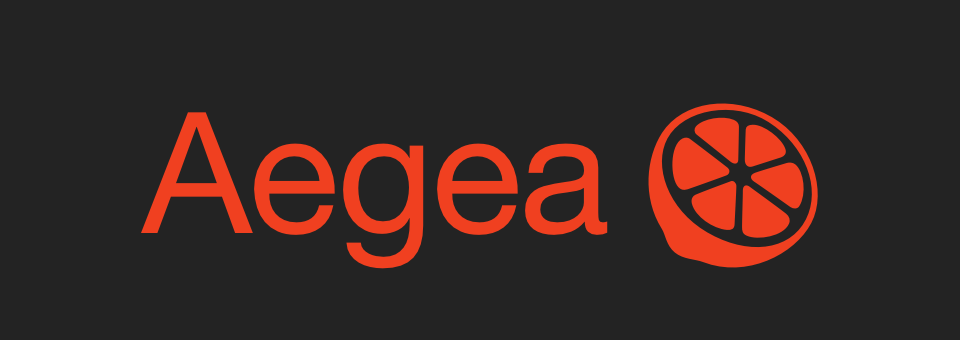

# Aegea

[Ilya Birman](https://ilyabirman.ru) released in 2003 (and is still developing) an excellent blogging engine - Aegea.

https://blogengine.me

You can feel the attention to detail and the thoughtfulness of many things while using it.  
I would like to highlight the following features:

- search
- comments
- auto-typography,
- cross-posting to Twitter, Telegram, etc.
- human readable URLs
- podcasts can be made automatically from posts with audio
- hotkeys

The engine is written in PHP, and this may scare away many for whom words like "hosting provider" are irretrievably a thing of the past.
There are working examples with Nginx and Caddy v1, but I never could get it to work with Caddy v2 (I had to proxy to Nginx).

#blog
