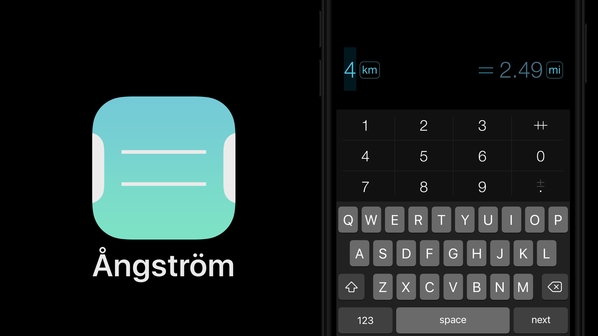

# Ångström

Angstrom is a unit of measure equal to 10-¹⁰ meters, as well as the name of another iOS app that has moved to my main screen, Ångström (from Alexander Babaev and Ilya Birman).

"Converts units and currencies faster than you type":
https://ilyabirman.net/projects/angstrom/

My most common use cases: to convert temperature from Fahrenheit to Celsius, miles to kilometers, and time zones.
Although the search bar "knows" about the same thing, it's much nicer to do it in the app.

https://apps.apple.com/us/app/ångström-the-unit-converter/id783839219

#app #ios #design #interface
