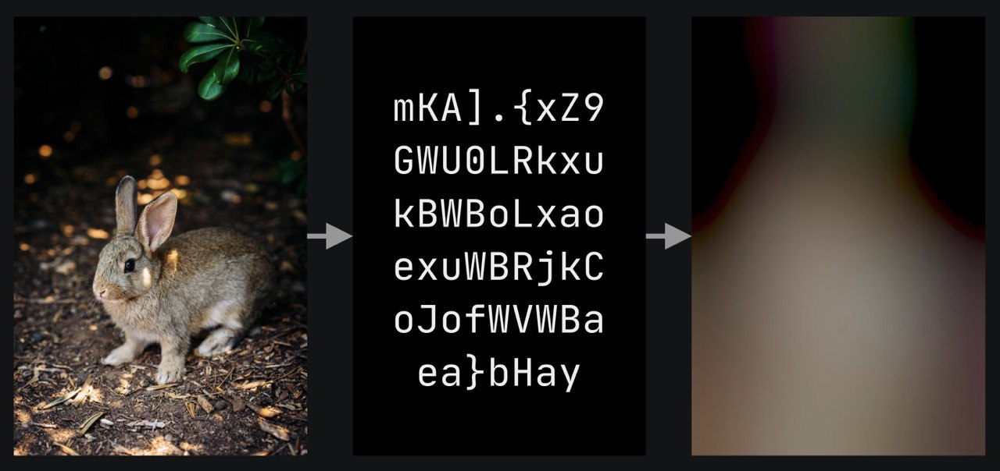
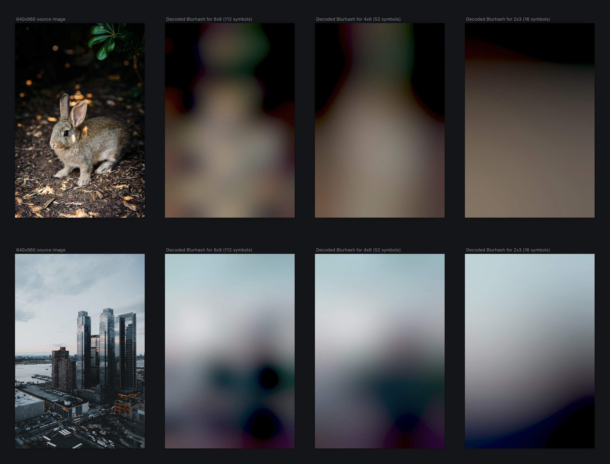

# Blurhash

Сегодня я хочу рассказать о Blurhash.
Идея довольно проста: картинку можно "ужать" до некого хеша который можно представить в виде короткой строки.
Из этой строки можно сгенерировать размытое изображение, отдаленно напоминающее оригинал.
Такое размытое изображение можно использовать как заглушку пока основная картинка грузится или для скрытия основного изображения по другим причинам (платный и/или взрослый контент).

Промо-страница может более доходчиво это все объяснить: https://blurha.sh
Основной репозиторий: https://github.com/woltapp/blurhash

Я поэкспериментировал немного с одной Gо библиотекой и сделал CLI к ней: https://github.com/chuhlomin/go-blurhash-experiment

Photo by Melissa Keizer on Unsplash https://unsplash.com/@keizgoesboom

#go #image
