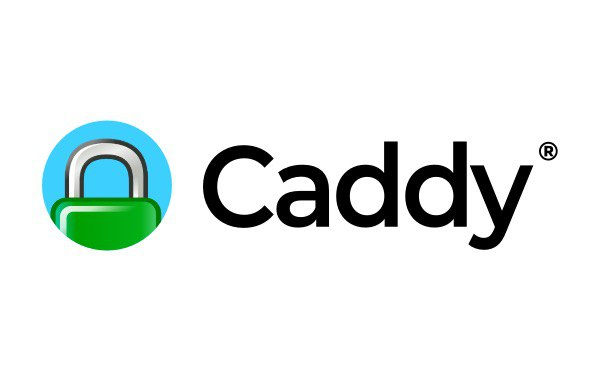

# Caddy (v2)



Многие наверняка слышали про nginx – высокопроизводительный веб-сервер используемый по всему миру, написанный Игорем Сысоевым (2004).
Работает nginx просто великолепно, и казалось бы – чего еще желать. С другой стороны, прошли годы, и сейчас многие вещи, я думаю, сделали бы по-другому.

И тут на сцену выходит набирающий популярность Caddy, написанный на Go:

- тоже проект с открытым исходным кодом,
- с простыми минималистичным конфигами,
- автоматически получает и обновляет сертификаты с Let's Encrypt, авто-редирект HTTP→HTTPS
- и много еще всего вкусного.

https://caddyserver.com

Например, вот так сейчас выглядит конфиг для одного проекта:

```
ts.chuhlomin.com {
  reverse_proxy timestamp:80
}
```

Все, больше мне не нужно думать о сертификатах.

Отдельно хочется отметить проект caddy-docker-proxy, который автоматически обновляет конфиг Caddy (сервер сам «подхватит» изменения) на основе меток (labels) у контейнеров:
https://github.com/lucaslorentz/caddy-docker-proxy

#app #ops #go
