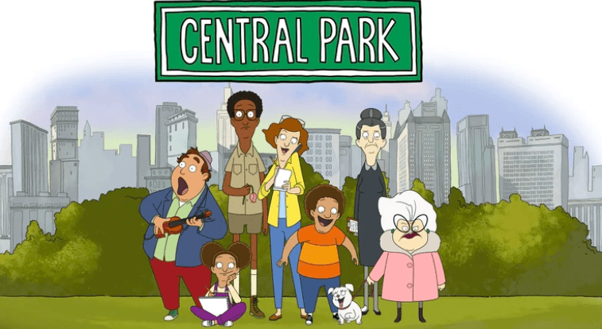

# Central Park

Central Park, an unexpectedly good family-friendly animated sitcom-musical, is available on Apple TV+.

The main plot is based on the confrontation between the family of the park manager (who lives in a house on the park grounds) and a devious developer who wants to build up New York's largest park.

Also, I'd like to highlight the narrator, a street musician who often breaks the fourth wall.

The music here is used to reveal the characters and move the plot along; you can appreciate it on Spotify (watch out for spoilers):
https://open.spotify.com/artist/2MU9NyN6HS8x0XdGsrmu7w?si=gGa0_MsTREeivpJ85o92Vw

10 episodes of 20-30 minutes, with only half a season out so far.

https://tv.apple.com/us/show/central-park/umc.cmc.4qe3i11erof30x0vz8nwnjkw3

#tvshow
