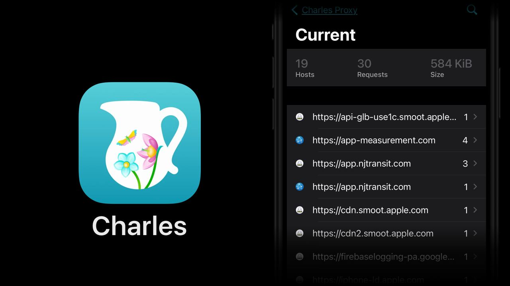

# Charles

Today I will tell you about the Charles application.
It's a clever proxy for MacOS/Windows/Linux, mainly used for listening to HTTPS traffic.
For example, you can set up your phone to go online through your computer with this proxy and see what requests and where they go.

https://www.charlesproxy.com

And with a mobile app, you can do all this right on your device.
I use it mainly to satisfy my curiosity: 

- what does the subway app API look like?
- In what format does Apple News get articles? (Protobuf)
- Where does the Twitter app get the feed from?

https://apps.apple.com/us/app/charles-proxy/id1134218562

#app #ios #macos #proto
