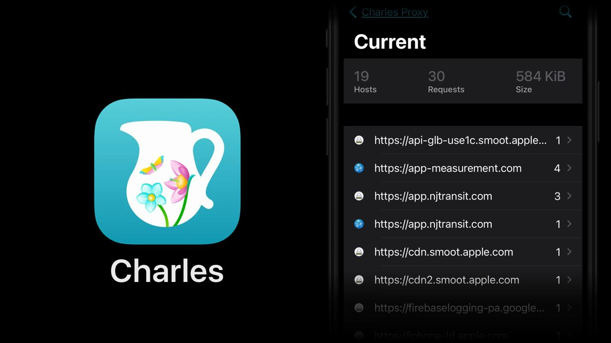

# Charles

Сдувая пыль с канала, сегодня расскажу про приложение Charles.
Это такой хитрый прокси для macOS/Windows/Linux, использующийся, в основном, для прослушивания HTTPS трафика.
Например, можно настроить телефон ходить в интернет через компьютер с этим прокси и смотреть какие запросы и куда уходят.

https://www.charlesproxy.com

А с помощью мобильного приложения можно всё это провернуть прямо на устройстве.
Я его использую в основном чтобы удовлетворить любопытство: 

- как выглядит API приложения метро?
- в каком формате Apple News получает статьи? (Protobuf)
- откуда приложение для Твиттера забирает ленту?

https://apps.apple.com/us/app/charles-proxy/id1134218562

#app #ios #macos #proto
