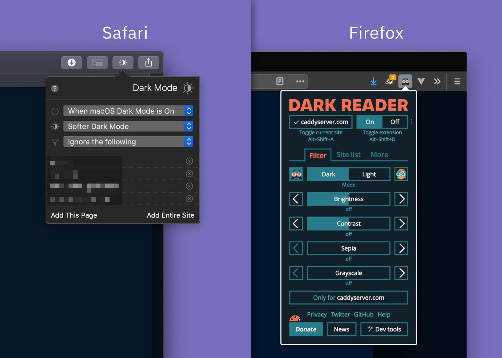

# Dark Mode

macOS, Windows, and other operating systems have, as of relatively recently, supported "dark mode."
Adaptation goes smoothly in the case of applications: they tend to use system libraries and have received support for "dark themes" without too much effort.

In the case of websites, it's not so simple.
If you are building a website, you can use a particular CSS media query:  
https://drafts.csswg.org/mediaqueries-5/#descdef-media-prefers-color-scheme

```css
body { color: black; background: white; }

@media (prefers-color-scheme: dark) {
  body { color: white; background: black; }
}
```

But not everybody has the time to update their sites. In this case, there are a few browser extensions that will adjust the colors on the site:



👌 Safari: DarkMode https://apps.apple.com/us/app/dark-mode-for-safari/id1397180934

🆗 Firefox (and others): Dark Reader https://darkreader.org

#interface
