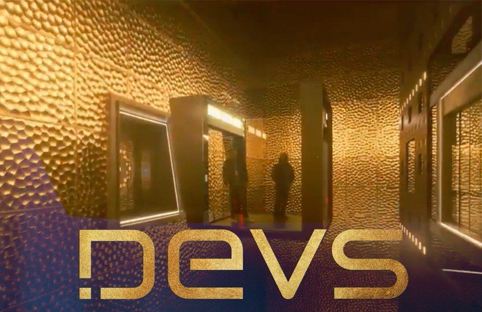

# Devs

В конце марта этого года вышел научно-фантастический триллер-мини-сериал Devs (Hulu, FX) в котором рассматриваются вопросы свободной воли и детерминизма. Законченная история повествует об инженере Лили Чан, которая в недалеком будущем расследует исчезновение своего парня после его первого рабочего дня в новом отделе корпорации Амайа – Devs. Чем занимается этот отдел известно лишь нескольким людям и держится в строжайшем секрете.

8 эпизодов ≈ по 50 минут
Apple TV: https://tv.apple.com/us/show/devs/umc.cmc.ggsldeofp8msuxqwfw7gevbd

Кому-то сериал может показаться медленным из-за долгих планов и больших пауз в диалогах, но лично я наслаждался и картинкой и игрой актеров.
Одну из главных ролей играет Ник Офферман, который может быть вам знаком по 45-и минутному ролику, где он просто молча сидит у камина и пьет виски: https://www.youtube.com/watch?v=LS-ErOKpO4E

Помещение в котором работают «разрабы» (на промо справа) отсылает к губке Менгера: https://ru.wikipedia.org/wiki/Губка_Менгера

#tvshow
