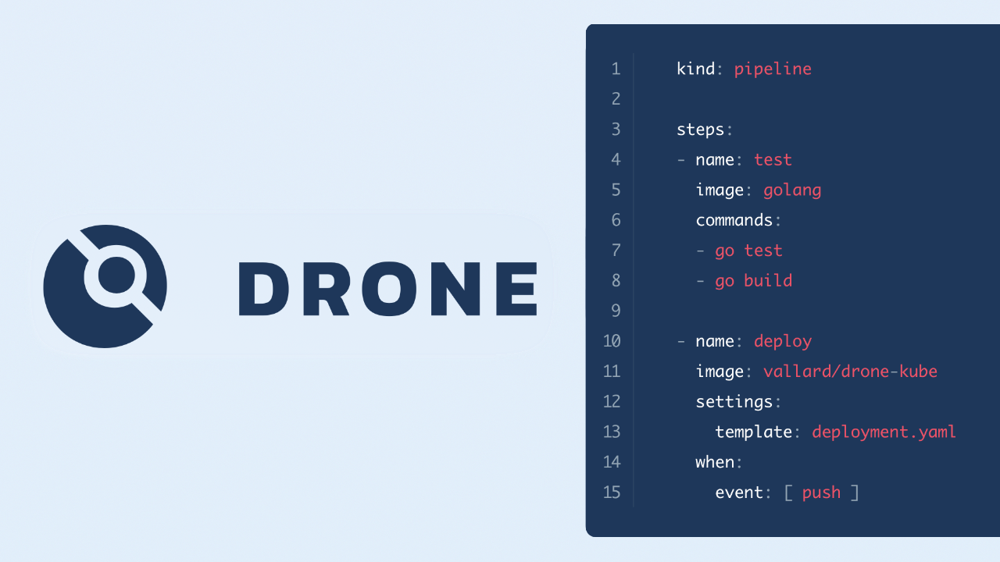

# Drone

I will tell you about a great open-source build system (Apache 2) on Go, based on Docker containers.

https://drone.io

https://github.com/drone/drone

A `.drone.yml` file is created in the repository's root with the description of the pipelines.
The point here is that all the commands are executed in containers.
You can make your own containers that will run as typical steps (and not rebuild every time, like in Github Actions).

Features:

- Parallel execution of steps,
- Secrets will be hidden in the logs, their values can not be seen in the settings,
- integration with Vault,
- Start of builds on schedule (cron).
- Pipeline description can be signed
- CLI toolkit and API

https://docs.drone.io

#ops #app
