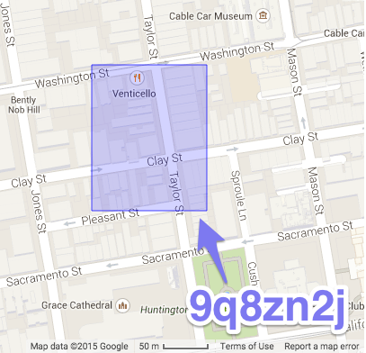

# GeoHash

In 2008, Gustavo Niemeyer came up with Geo Hash, representing an area on a map as a string of characters.
The longer the string, the more accurate/less area.

https://en.wikipedia.org/wiki/Geohash

Interactive map (select "GeoHash" in the upper right corner)
http://missinglink.github.io/leaflet-spatial-prefix-tree/

Go library: https://github.com/mmcloughlin/geohash

#geo
