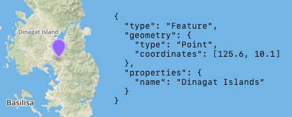

# GeoJSON

GeoJSON is a format for describing geo-data using JSON.

https://en.wikipedia.org/wiki/GeoJSON 
https://geojson.org

In 2015, the IETF (Internet Engineering Task Force) and a group of authors of the original specification joined together to form the GeoJSON Standardization Working Group. In 2016 they published RFC7946 "The GeoJSON Format":
https://tools.ietf.org/html/rfc7946

This is where you can interactively create/debug GeoJSON:
https://geojson.io

By the way, as of 2019, this is the format Apple recommends adding data to the map when using their MapKit/MapKit JS:
https://developer.apple.com/videos/play/wwdc2019/236/

Moreover, Apple has created a GeoJSON-compatible IMDF (Indoor Mapping Data Format) for describing rooms:
https://register.apple.com/resources/imdf/

Go library: https://github.com/paulmach/go.geojson

#rfc #geo
