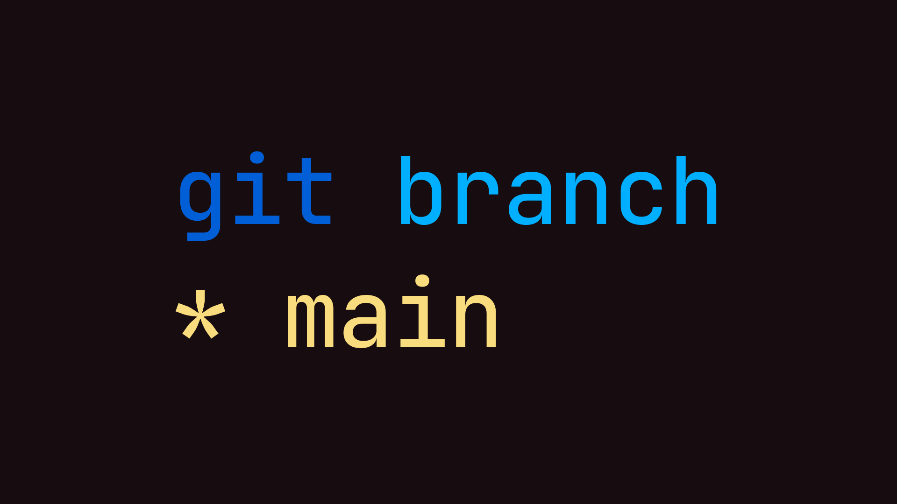

# Git: main



В Git, начиная со свежей версии 2.28, появилась опция изменить название ветки по-умолчанию с `master` на что-то другое, например, `main`:

```bash
git config --global init.defaultBranch main
```

Меня в данном решении привлекает то, что main короче и «рифмуется» со штуками из мира Go: `main.go`, `package main`, `func main`.

В общем, переходите на main в новых проектах.

```bash
git branch -m master main
git fetch origin
git branch -u origin/main main
```

#git