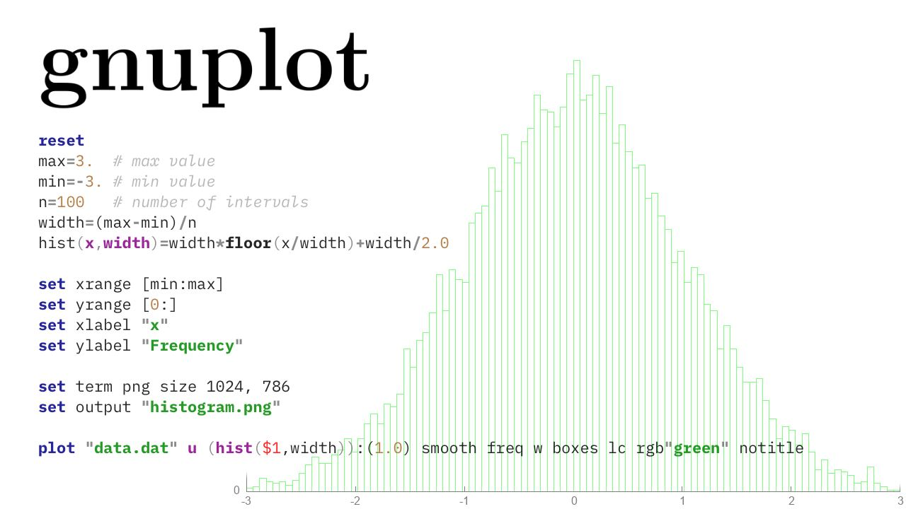

# gnuplot

Gnuplot is one of the simplest and most powerful programs for visualizing data.
It generates a PNG or SVG image from a file with a description of how to build a diagram and one or more data files.

http://www.gnuplot.info

Available on all major platforms; great with awk.

#visualization #cli
