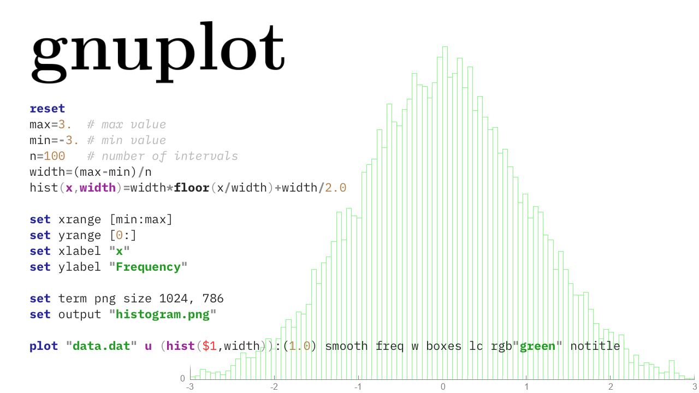

# gnuplot

Gnuplot – одна из самых простых и мощных программ для визуализации данных.
Она из а файла с описанием того, как строить диаграмму, и одиним или несколькими файлами с данными генерирует изображение в формате PNG или SVG.

http://www.gnuplot.info

Есть на всех основных платформах; отлично сочетается с awk.

#visualization #cli
