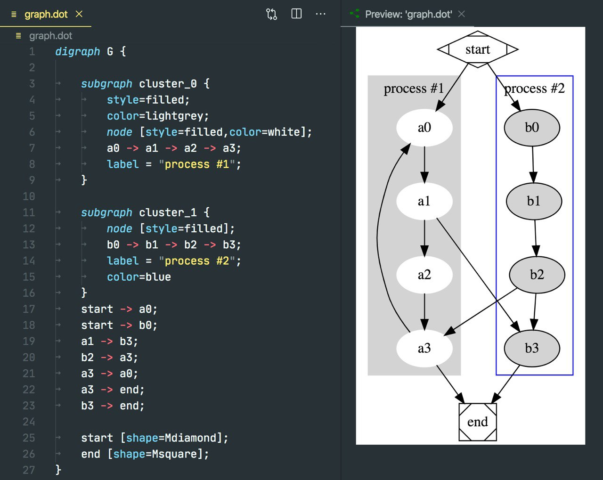
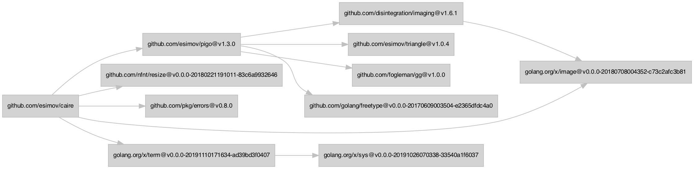

# Graphviz

If you don't know what graphs are, in short, it's a set of vertices in links (edges) between them.

https://en.wikipedia.org/wiki/Graph_(discrete_mathematics)

You can use graphs to represent a subway map, an organization structure, an NPC path map, an ERD.

Graphviz is an excellent tool for visualizing structured data in the form of graphs and networks.

https://graphviz.org

`dot` (one of the programs in the set) can convert directed graphs described in Dot format into an image (PNG, SVG), trying to make the edges overlap as little as possible.

https://graphviz.org/doc/info/lang.html

```bash
dot -Tsvg -o graph.svg graph.dot
```



The screenshot shows the work of the plugin for VSCode: https://marketplace.visualstudio.com/items?itemName=joaompinto.vscode-graphviz

By the way, I have such a small snippet to visualize dependency graph in Go projects:

```bash
echo "digraph {
rankdir = LR
node [shape=rectangle fontname=GoMono fontsize=10 style=filled color=gray fillcolor=lightgray ]
edge [color=gray]
nodesep = 0.2
`go mod graph | awk '{ print \"\\"" $1 "\\" -> \\"" $2 "\\"\" }'`
}" | dot -Tsvg > dependency_graph.svg
```

Here is an example of such a graph for a project: https://github.com/esimov/caire

[](dependency_graph.png)

#visualization #go
