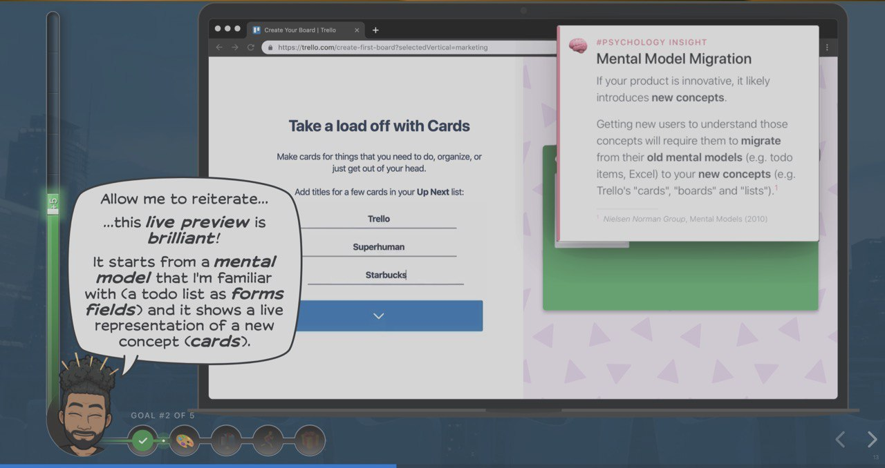

# Growth.Design

I strongly recommend looking at the work of Growth.Desing (a couple of guys from Menreal).

In Case Studies they review popular sites and apps (Tinder, Airbnb, Trello, ...).
They point out the pros and cons of specific solutions in the context of UX and company growth.
They back up their arguments with references to sources and examples.

⚡️ https://growth.design/case-studies/

Somewhat similar to UserOnboard, but with a focus on business development
https://www.useronboard.com/user-onboarding-teardowns/

They recently launched a new section (which is still being finalized): "The Psychology of Design: 101 Cognitive Distortions and Principles That Influence Your UX."

🧠 https://growth.design/psychology/

#site #design #interface
