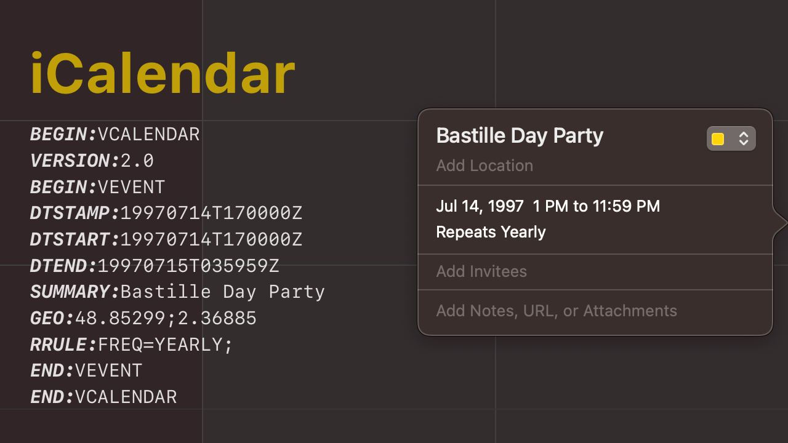

# iCalendar

События в вашем календаре хранятся, скорее всего, в формате iCalendar (.ics).
https://en.wikipedia.org/wiki/ICalendar

Для описания частоты повторения собития изобрели свой формат – recurrent rule (RRULE/RECUR). RRule cама по себе довольно гибкая штука, позволяющая задавать такие правила как «каждую субботу января в 8:30 и 9:30 утра каждый второй год»:
`RRULE:FREQ=YEARLY;INTERVAL=2;BYMONTH=1;BYDAY=SU;BYHOUR=8,9;`
https://tools.ietf.org/html/rfc5545

Для разбора RRule нашёл несколько библиотек:

- JS: https://github.com/jakubroztocil/rrule
- Go: https://github.com/JulienBreux/rrule-go
- Python: http://labix.org/python-dateutil/

#rfc
