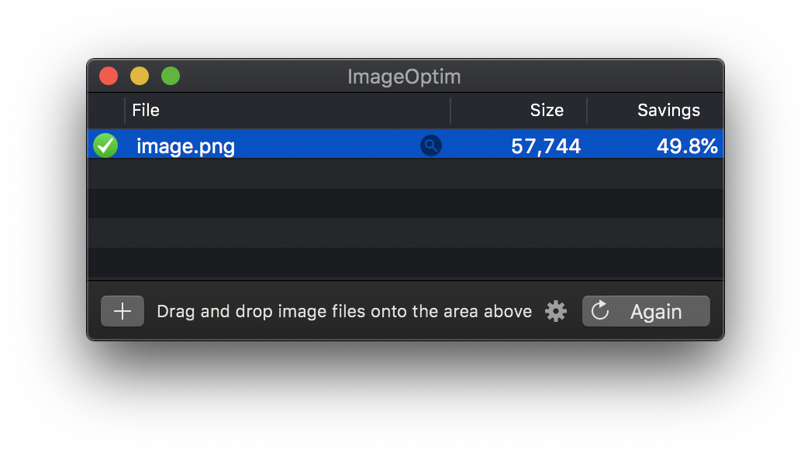

# ImageOptim

Не секрет, что у изображений бывают матаданные: геолокация, устройство с которого сделано фото и так далее (см. EXIF, IPTC и XMP). Не всегда этой информацией хочется делиться отправляя кому-то письмо например.

Недавно нашел и советую бесплатный ImageOptim который удаляет все эти данные:
https://imageoptim.com

Больше советов в старой статье на CNET:
https://www.cnet.com/how-to/remove-metadata-from-office-files-pdfs-and-images/

#macos #app
