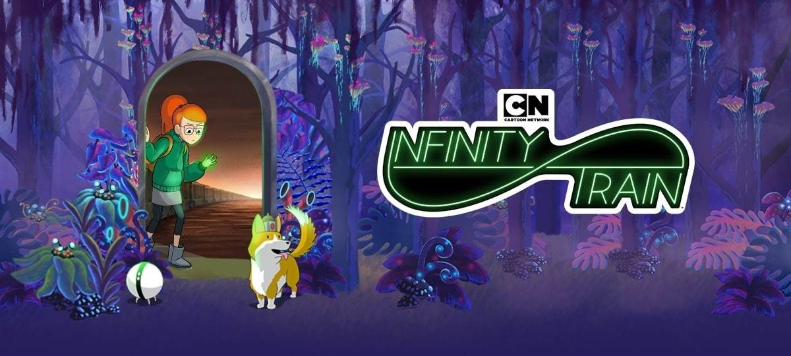

# Infinity Train

Watched "Infinity Train" (Cartoon Network, HBO Max), a series about doing the right thing and acknowledging your problems.
The setting is a mystical giant train, apparently endless.
The wagons of this train contain a variety of whole fantastical worlds.
The main characters of the first season (a girl named Tulip, the robot One-One, and the king of Corgania, the talking corgi Atticus) are looking for a way out of the train.
By the way, the character is voiced by Ashley Johnson, who voiced Ellie from Last of Us.

2 seasons (third season starts in August).  
10 episodes per season ≈ 11 minutes each.  
One season is one complete story.

Apple TV: https://tv.apple.com/us/show/infinity-train/umc.cmc.6o7cfts3oihvyb5xepdz9m5zn

HBO Max: https://play.hbomax.com/series/urn:hbo:series:GXkNXsArG_o7CZgEAABfH

Soundtrack: https://open.spotify.com/album/23qhNkm9OvDKMiJBe5iCP8?si=M6IRvk-7Q0CrH-8yScooyw

#tvshow
