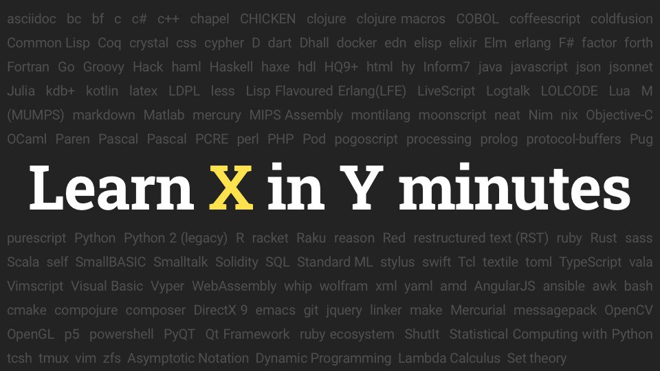

# Learn X in Y minutes

Adam Bard из Канады в 2013 году сделал проект «Learn X in Y minutes» – сайт с короткими туториалами по разным языкам программирования для программистов, позволяющий быстро освоить новый язык.

https://learnxinyminutes.com

В конце статей, как правило, приведены ссылки на дополнительные материалы.
Многие статьи переведены на несколько языков, в проекте уже приняло участие 1466 человек.

https://github.com/adambard/learnxinyminutes-docs

Мне проект оказался очень полезен уже несколько раз, горячо всем советую.

#site
