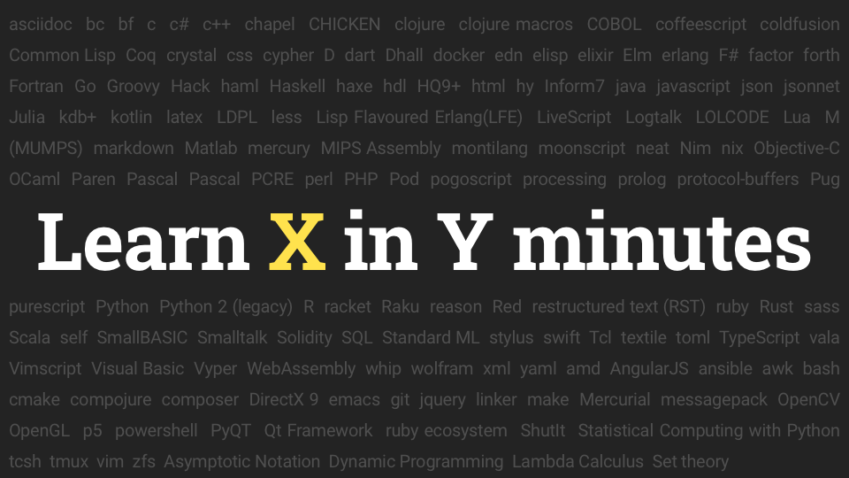

# Learn X in Y minutes

Adam Bard from Canada in 2013 made a project "Learn X in Y minutes" – a website with short tutorials on different programming languages for programmers to quickly learn a new language.

https://learnxinyminutes.com

At the end of the articles, as a general rule, there are links to additional materials.
Many articles are translated into several languages, and 1466 people have already joined the project.

https://github.com/adambard/learnxinyminutes-docs

I found the project very useful several times already, I warmly recommend it.

#site
