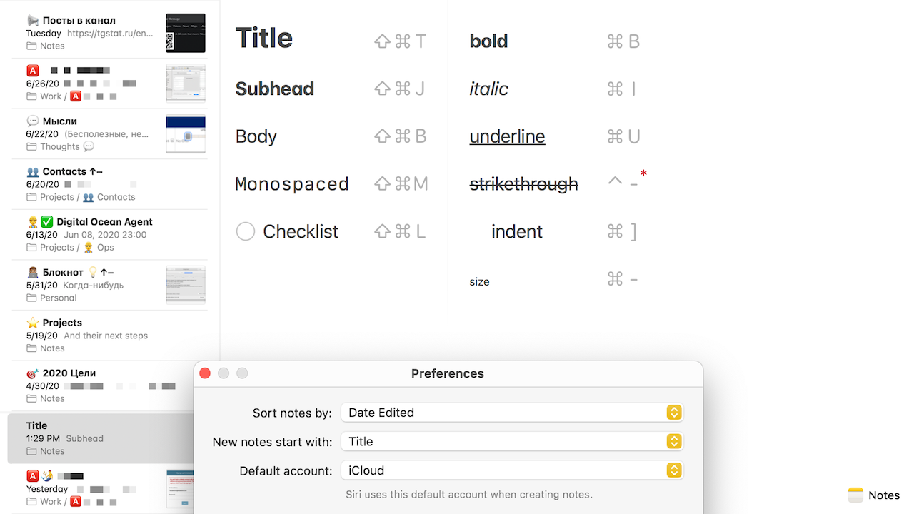

# Notes

Мне кажется многие незаслуженно обходят приложение Notes стороной.
Да, у него нет тех несчётных фич, которые есть у конкурентов, но, может, они и не нужны большинству пользователей?

Я пользуюсь Notes уже много лет и вот что могу посоветовать:

- используй горячие клавиши – с ними использование любого приложения становится приятнее, быстрее,
- где приемлемо, используй Emoji (⌃⌘Пробел)
- поставь в настройках начинать «заметки с заголовков»,
- ставь дату и время в начале каждой заметки и по мере написания (см. мою первую заметку про #alfred),
- прикрепляй особенно важные заметки.

Также можно настроить горячие клавиши для любых пунктов меню:

#app #macos #notes #emoji
