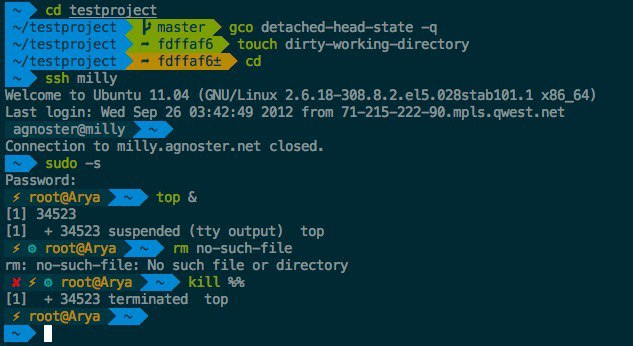

# Oh My ZSH!

При работе в терминале многие используют Bash – «одну из наиболее популярных разновидностей командной оболочки UNIX» (Wikipedia).
Немного искушенные пользователи наверняка знают еще про Fish (https://fishshell.com) и Zsh (http://zsh.sourceforge.net).

Я бы хотел рассказать про Oh My Zsh – «фреймворк для управления конфигурации Zsh».
На обывательском это «завезли плагины, темы, и хелперы».

https://ohmyz.sh

Даже если ты уже используешь OhMyZsh, все равно посмотри на список плагинов, может быть найдешь что-то полезное (например common-aliases, alias-finder).

Темы: https://github.com/ohmyzsh/ohmyzsh/wiki/Themes 
Плагины https://github.com/ohmyzsh/ohmyzsh/tree/master/plugins

Ну а напоследок рекомендую zsh-autosuggestions, который добавляет подсказки к недописанной команде на основе истории, как в Fish.  
https://github.com/zsh-users/zsh-autosuggestions
(может быть установлен как плагин OhMyZsh)

#cli
