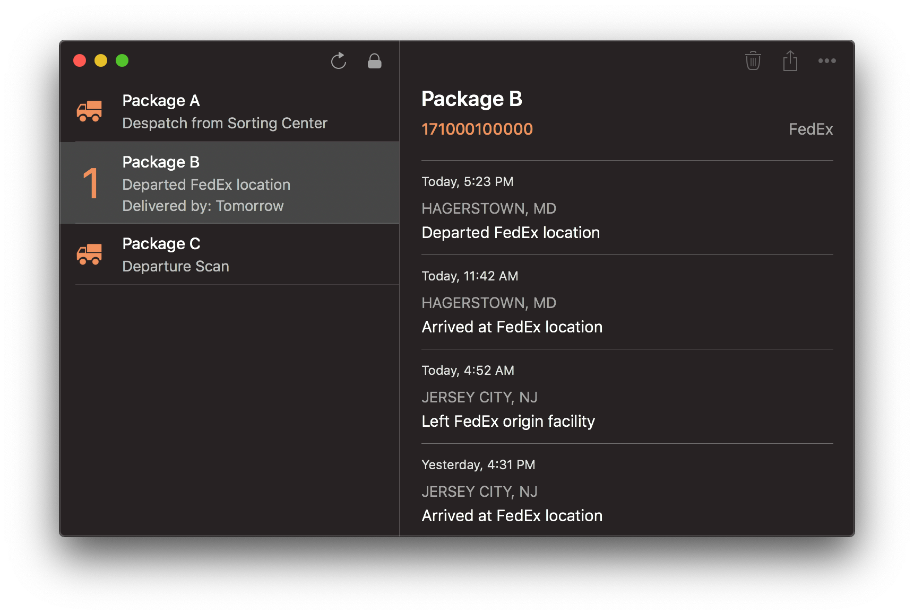

# Parcel

(программа для MacOS и iOS)

Сайты у разных служб доставок посылок разные, со своей, по-разному странной логикой, как правило, вырвиглазные, всегда желающие знать ваше местоположение. Поэтому, заходить на такие сайты, а тем более, искать в архивах почты письмо с номером отслеживания – процедура не из приятных.

К счастью, разработчик с близким уху именем Ivan Pavlov создал приложение Parcel, которым я с удовольствием пользуюсь уже несколько лет.
Оно позволяет отслеживать несколько посылок в едином простом интерфейсе.
Поддерживается множество служб доставки по всему миру.
При наличии данных, можно посмотреть маршрут посылки на карте прямо в приложении.

Бесплатно при отслеживании до 3х посылок одновременно.
Примерно за $3/год это ограничение можно снять и получить вдобавок еще несколько приятных фишек.

https://parcelapp.net

#app #macos #ios
