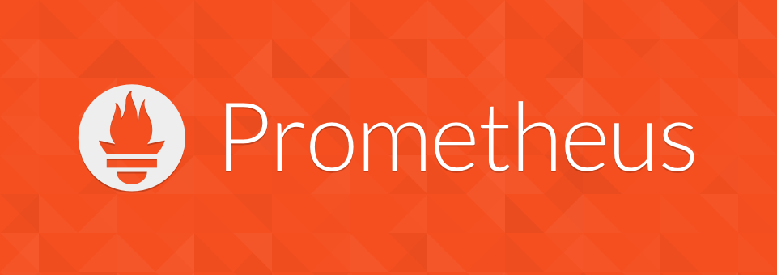

# Prometheus

For several years now, I've been using (and advising everyone) Prometheus, an open-source monitoring system (Go, Apache-2.0) created by SoundCloud back in 2012.
https://prometheus.io/

The applications you want to "monitor" don't have to knock themselves somewhere saying "here are my metrics" (push), but instead, Prometheus periodically queries all applications for their current metrics (pull). The format of the expected response from the application is well defined so that you can replace Prometheus with something else, for example, DataDog, if you want.
There is a lot of good stuff there: custom query language PromQL, service discovery, labels, ...

With anticipation, I look at the OpenMetrics project, inspired by Prometheus, which aims to standardize the format of metrics exchange.

https://openmetrics.io/

https://github.com/OpenObservability/OpenMetrics

#ops
