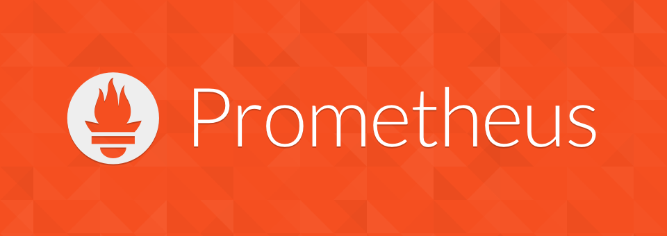

# Prometheus

Уже несколько лет я пользуюсь (и всем советую) Prometheus – система мониторинга с открытым исходным кодом (Go, Apache-2.0), созданная SoundCloud еще в 2012 году.
https://prometheus.io/

Приложения, которые вы хотите «мониторить», не должны сами куда-то стучаться, мол, «вот мои метрики» (push), а наоборот, Prometheus периодически опрашивает все приложения об их текущих метриках (pull). При этом хорошо определен формат ожидаемого текстового ответа от приложения, что позволяет, при желании, заменить Prometheus на что-то другие, например, DataDog.
Там много всего вкусного: свой язык запросов PromQL, service discovery, метки, ...

С предвкушением смотрю на проект OpenMetrics, вдохновленный Prometheus, который хочет стандартизировать формат обмена метриками.

https://openmetrics.io/

https://github.com/OpenObservability/OpenMetrics

#ops
