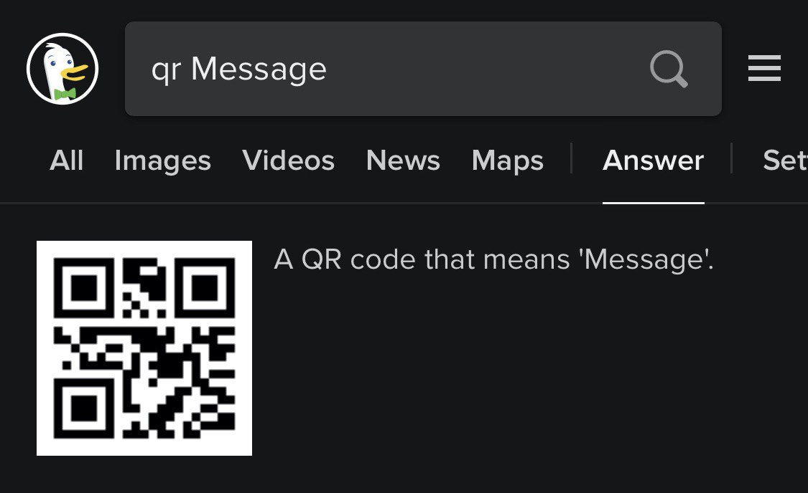

# QR

Недавно открыл для себя что поисковик DuckDuckGo генерирует QR код по запросу начинающемуся с «qr » (умеет так c 2013 года!).

Кстати, помимо простого текста в QR код можно записать:

- данные вай-фай сети, включая пароль (поищите QR код на вашем модеме): `WIFI:T:WPA;S:mynetwork;P:mypass;;,`
- геолокацию: `geo:40.71872,-73.98905,100,`
- события (название, даты и время начала и конца)
- вредоносную ссылку,
- а также много еще чего.

Больше информации собрано здесь: https://github.com/zxing/zxing/wiki/Barcode-Contents

Для языка программирования Go есть несколько неплохох библиотек для работы с QR кодами, я пользовался вот этой: https://github.com/liyue201/goqr

#qr #go
