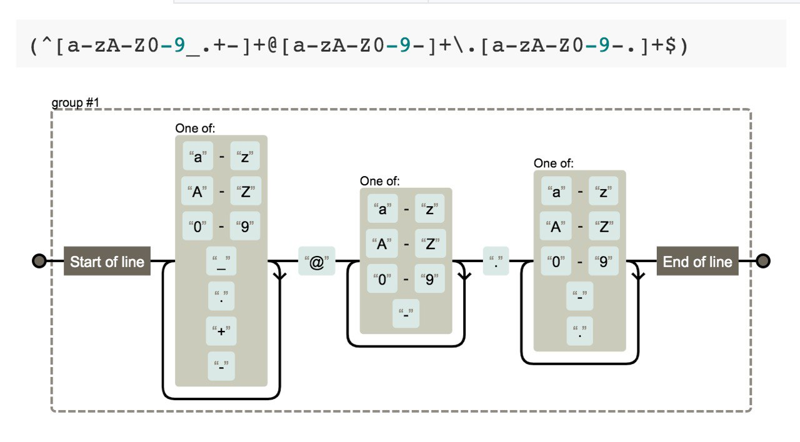

# Регулярные выражения

В 1943 году Уоррен Мак-Каллок и Уолтер Питтс опубликовали научную статью «Логическое исчисление идей лежащих в основе нервной деятельности» в которой они пытались понять работу мозга путем моделирования нейронов. Тогда они еще не знали что их работа произведет огромное влияние на компьютерную науку.
https://www.cs.cmu.edu/~./epxing/Class/10715/reading/McCulloch.and.Pitts.pdf

В 1951 году американский математик Стивен Коул Клейни в своей работе «Представление событий в нервных сетях и конечных автоматах» доказал идеи Мак-Каллоа и Питтса и формализовал определение «регулярный язык» – формальный язык который может быть описан с помощью регулярного выражения.
https://www.rand.org/content/dam/rand/pubs/research_memoranda/2008/RM704.pdf

А еще чуть позже, в 1968, Кен Томсон (кстати, со-автор языка Go) опубликовал статью «Regular Expression Search Algorithm».
https://www.clear.rice.edu/comp412/Lectures/Support/Thompson-1968.pdf

Регулярное выражение (регулярка) – это шаблон/паттерн задающий правила поиска (или замены) подстроки в строке.

Цитируя русскую Википедию, при помощи регулярных выражений можно задать шаблоны, позволяющие:

- найти все последовательности символов «кот» в любом контексте, как то: «кот», «котлета», «терракотовый»;
- найти отдельно стоящее слово «кот» и заменить его на «кошка»;
- найти слово «кот», которому предшествует слово «персидский» или «чеширский»;
- убрать из текста все предложения, в которых упоминается слово кот или кошка.

Сайты для проверки и тестирования регулярных выражений:
https://www.regexpal.com, https://regexr.com

А для проверки своих навыков в написании регулярок могу посоветовать:

* https://regexcrossword.com – кроссворды (есть версия для мобильного!)
* https://www.hackerrank.com/domains/regex – задачи
* https://brilliant.org/practice/regular-expressions – тесты

Не стоит забывать и две мудрости:
«У вас есть проблема. Вы решили использовать регулярные выражения. Теперь у вас две проблемы».
«Если у человека в руках молоток, то ему везде мерещатся незабитые гвозди.»
