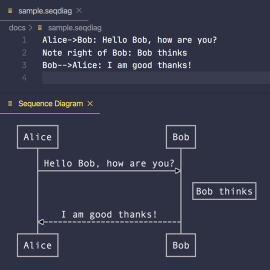

# Sequence Diagrams

The UML language includes "sequence diagrams," which show the order in which several objects interact.
https://www.uml-diagrams.org/sequence-diagrams.html

Andrew Brampton wrote a JS library for generating sequence diagrams from a text: https://bramp.github.io/js-sequence-diagrams/

And based on that library, Aleksandar Toplek from Croatia made a VSCode extension:
https://marketplace.visualstudio.com/items?itemName=AleksandarDev.vscode-sequence-diagrams



Don't forget to configure style in `settings.json`:
```json
"sequencediagrams.diagram.style": "simple"
```

#vscode #visualization
