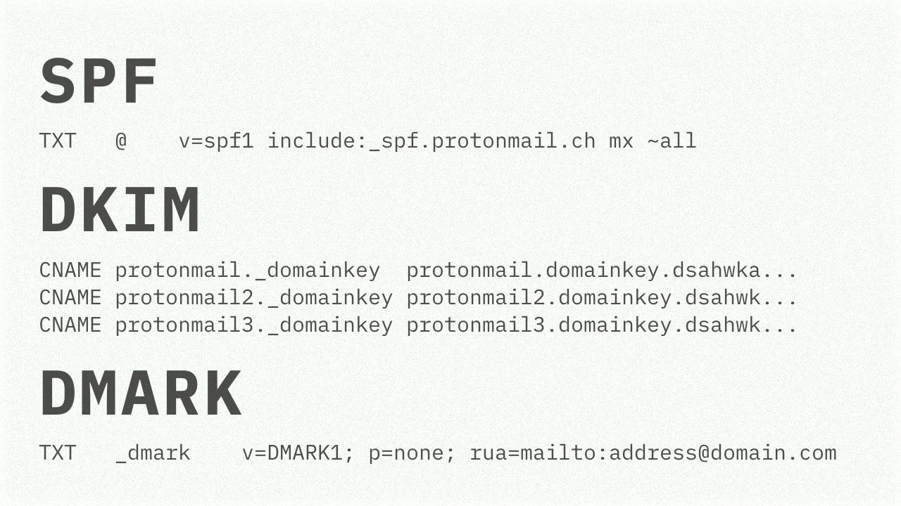

# SPF, DKIM, DMARK

Обладателям почты-на-собственном-домене строго рекомендуется и всячески советуется настроить несколько механизмов:

SPF (Sender Policy Framework) – в DNS записи домена указывается какие хосты/IP могут отправлять почту «от вашего имени».
https://tools.ietf.org/html/rfc7208

DKIM (DomainKeys Identified Mail) – позволяет «защитить» письмо от изменений извне: содержимое письма подписывается приватным ключом при отправке,
публичный ключ «публикуется» в DNS записи домена.
https://tools.ietf.org/html/rfc6376

Эти проверки делает сервер электронный почты, и в случае, если проверки не прошли, на адрес указанный в DMARK – Domain-based Message Authentication, Reporting and Conformance – DNS-записи домена будет отправлен отчет в стандартном формате.
https://tools.ietf.org/html/rfc7489

B желании поковырять приходящие мне DMARK отчеты, я написал небольшую библиотеку на Go: https://github.com/chuhlomin/dmark-go

#rfc #go
