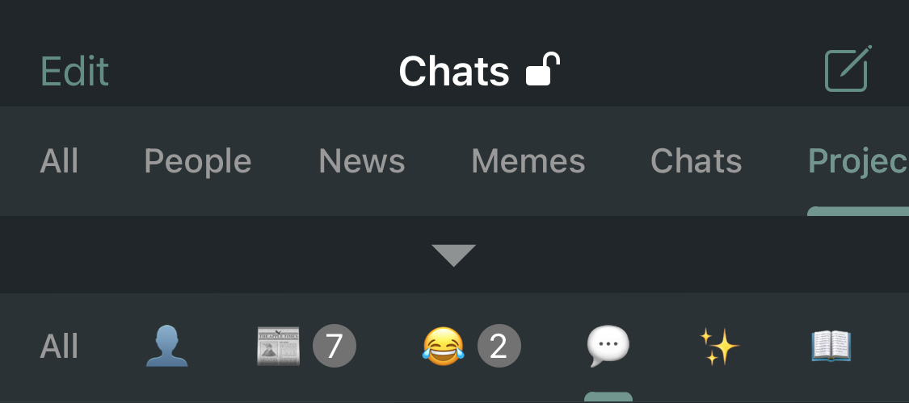

# Folders in Telegram

At the end of March, Telegram released a new feature: folders.
Finally, it became possible to bring at least some order to the endless channels and chats.

But naming folders with words eats up a lot of valuable space, and folders have to be scrolled separately as well.
I suggest using emoji for this purpose - it's succinct and compact.

#telegram #emoji #advice
