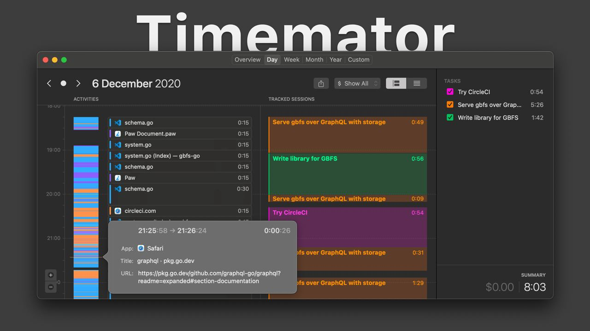

# Timemator

The program allows you to track your actions in the system: what program, what document was active, and for how long.
Blocks of time can be marked as spent on some task. Timemator can automatically identify the task you are working on based on the open programs and files.

It might come in handy for freelancers who bill for time spent.
I like keeping track of time spent on a task.
It can also be used as an alternative browser history search.

https://timemator.com

It is not recommended for paranoics.  
The trial is thirty days, and a lifetime license costs $39.  
Today available for 19.50.

#app #macos #timestamp
