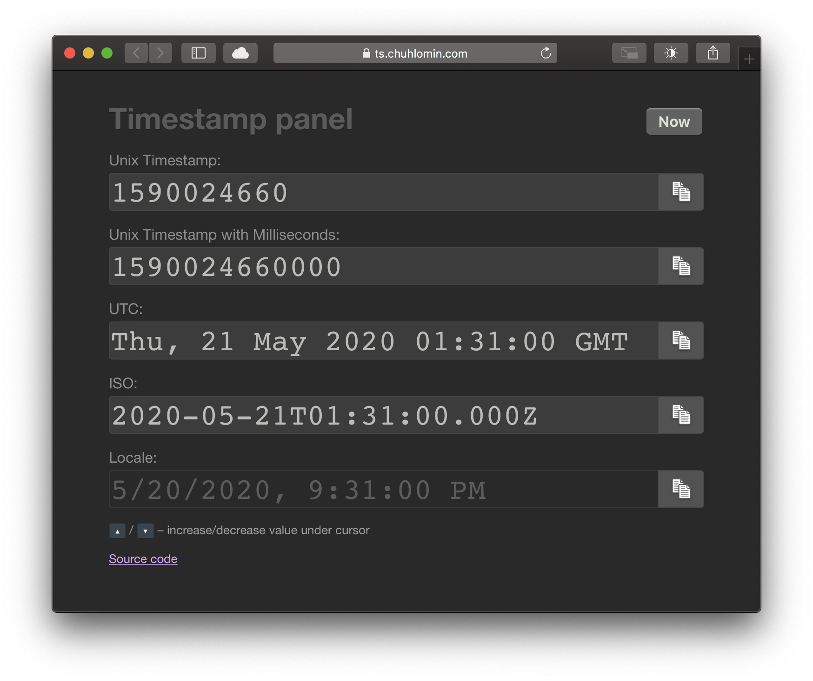

# Timestamp Panel

Software engineers often have to deal with timestamps. As I told earlier (see post about [Alfred](alfred.html)), I use the format "May 20, 2020 21:31" in my notes.
However, for technical uses, this format is unacceptable - the time zone is not specified, there are problems when switching to winter/summer time, does not take into account the extra second.

Normally, everyone uses Unix timestamp – the number of seconds since the beginning of 1970 (the beginning of the Unix era) in the zero meridian, for example, 1590024660.
Yes, it's hard to determine a specific date at a glance, but at least you don't have to deal with time zones and the like.

There are countless ways to translate from one format to another.
Sometimes it's easier to write a piece of code, sometimes it's easier to find a site that does it for you.
Off the top of my head, https://unixtimestamp.com and https://epochconverter.com come to mind. Both are not the most pleasant to use.

In wanting to try the VueJS framework, I rolled up my sleeves and did it:
https://ts.chuhlomin.com

https://github.com/chuhlomin/timestamp

#project #timestamp
