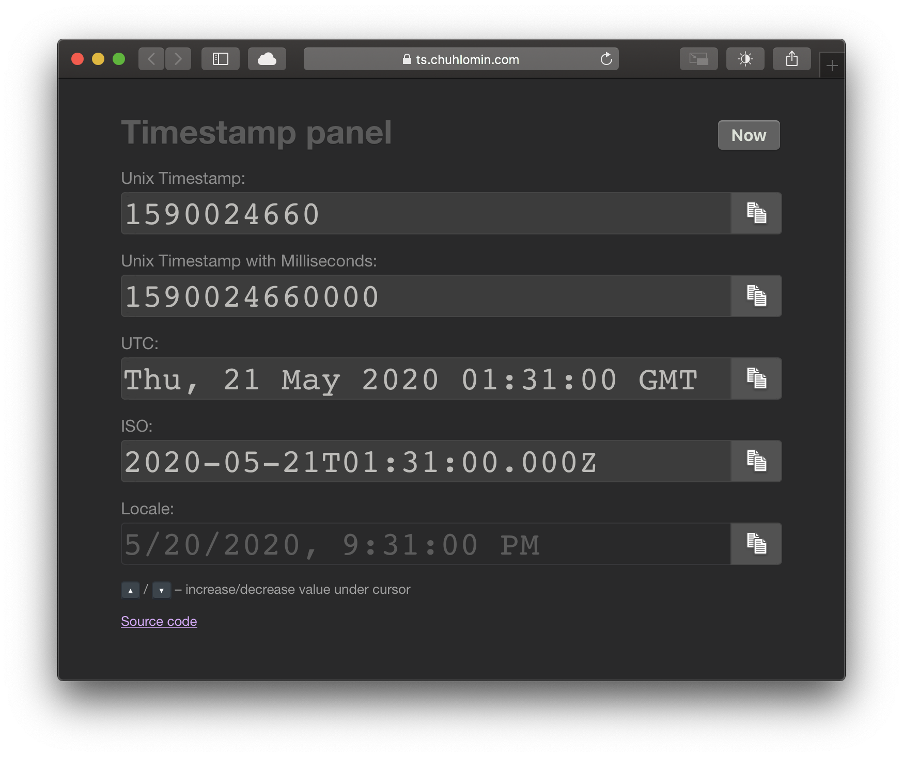

# Timestamp Panel

Разработчикам часто приходится иметь дело с временными метками.
Как я рассказывал ранее (см. пост про [Alfred](alfred.html)), в заметках я использую формат «May 20, 2020 21:31».
Однако, в технических задачах такой формат неприемлем – не указан указан часовой пояс, есть проблемы при переходе на зимнее/летнее время, не учитывается дополнительная секунда.

Как правило, все используют Unix timestamp – число секунд с начала 1970 года (начала эпохи Юникс) в нулевом меридиане, например, 1590024660.
Да, определить конкретную дату на глаз сложно, но зато не нужно иметь дело с часовыми поясами и тому подобным.

Есть бесчисленное множество способов перевода из одного формата в другой.
Иногда проще написать кусок кода, иногда – найти какой-нибудь сайт который это сделает за тебя.
Навскидку на ум приходят: https://unixtimestamp.com и https://epochconverter.com. Оба не самые приятные в плане использования.

В желании попробовать фреймворк VueJS я таки закатал рукава и сделал:
https://ts.chuhlomin.com

https://github.com/chuhlomin/timestamp

#project
