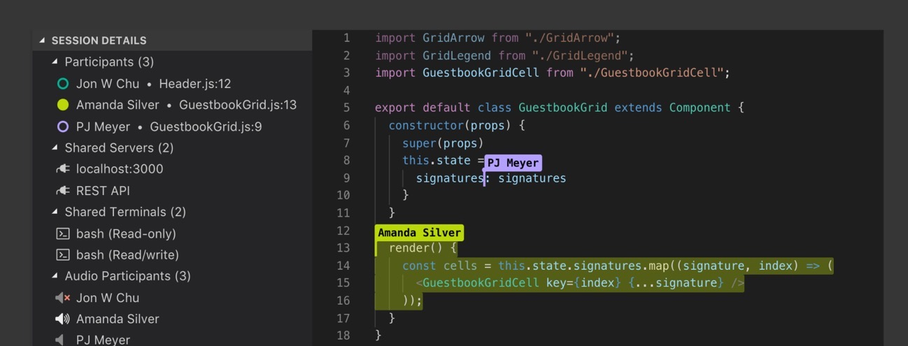

# VSCode Live Share

Недавно довелось потрогать Live Share в VSCode – этакий Google Docs для групповой работы с кодом.

https://visualstudio.microsoft.com/services/live-share/

После логина через GitHub или Microsoft аккаунт с помощью этого расширения можно начать «Лайв-сессию» и кинуть коллеге ссылку.
Коллега подключается к сессии и получает доступ к файлам проекта из своего редактора (со своими настроенными горячими клавишами): VSCode или Visual Studio.

Работает не идеально, но уже достаточно хорошо чтобы этим пользоваться.
В довесок предлагаются расширения добавляющие чат и аудио связь.

С марта тестируется подключение к «Лайв-сессии» из браузера.

Вводное видео и описание:
https://code.visualstudio.com/blogs/2017/11/15/live-share

Возможные применения:
https://docs.microsoft.com/en-us/visualstudio/liveshare/reference/use-cases

#vscode
