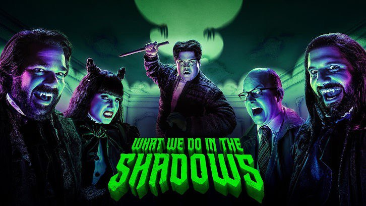

# What we do in the shadows

Другой отличный (пока) сериал – What we do in the shadows (2019, FX, Hulu).

В 2014 году вышел одноименный фильм в жанре мокументари-хоррор-комедия, где группа операторов снимает быт трех вампиров в современном мире. В русском прокате его назвали «Реальные упыри».

В 2018 Ново Зеландский телевизионный канал TVNZ 2 начал выпускать спин-офф сериал «Wellington Paranormal» про полицейских из фильма, которые расследуют паранормальные явления в том же городке. Получилось очень средне, с глупыми шутками и скучными историями.

Мне, как фанату фильма, новый сериал нравится сильно больше. Место действия из Новой Зеландии перенесли на Статен-Айленд (часть города Нью-Йорк). На первом плане: четверо вампиров и человек-прислужник. В одном из эпизодов есть красивое «камео» вампиров из оригинального фильма.

В сезоне 10 эпизодов. ≈ 22 минуты эпизод. 
У сериала недавно начался второй сезон.

Apple TV: https://tv.apple.com/us/show/what-we-do-in-the-shadows/umc.cmc.2bss05wnkfezkywhivjc7ikml

#tvshow
