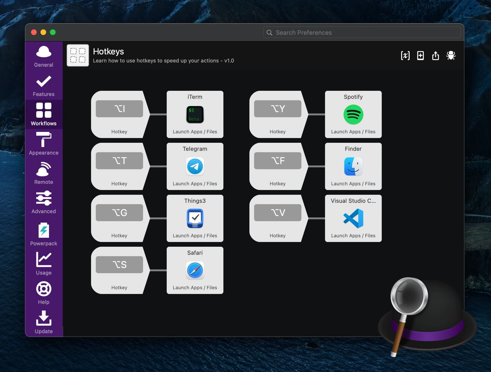

# Alfred Hotkeys Workflow

Для перемещения между приложениями на MacOS обычно используются Alt+Tab / Alt+Shift+Tab (быстрее) или док (медленнее). Частое клацанье по Табу становится утомительным занятием, и хочется нажать какое-нибудь сочетание клавиш один раз, чтобы сразу перейти в это приложение.

Для этого есть несколько решений, я остановился на Alfred. С покупкой Powerpack (£29) становятся доступны Workflows, где можно накрутить разного, включая запуск приложений по хоткеям (см. скриншот).
https://www.alfredapp.com/workflows/

В качестве альтернативы ещё могу посоветовать свежий и бесплатный Anykey, с простым JSON-конфигом:
https://github.com/temochka/Anykey

#app #macos
