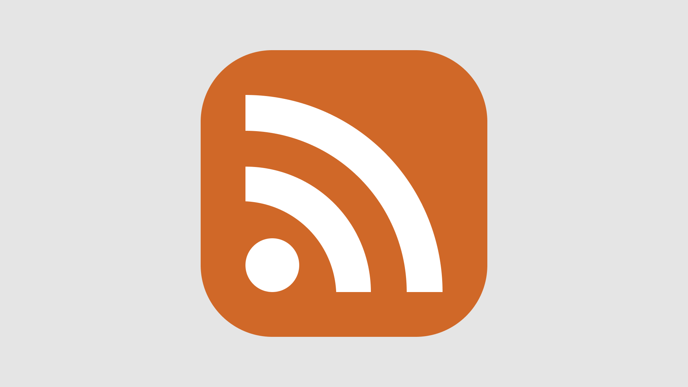
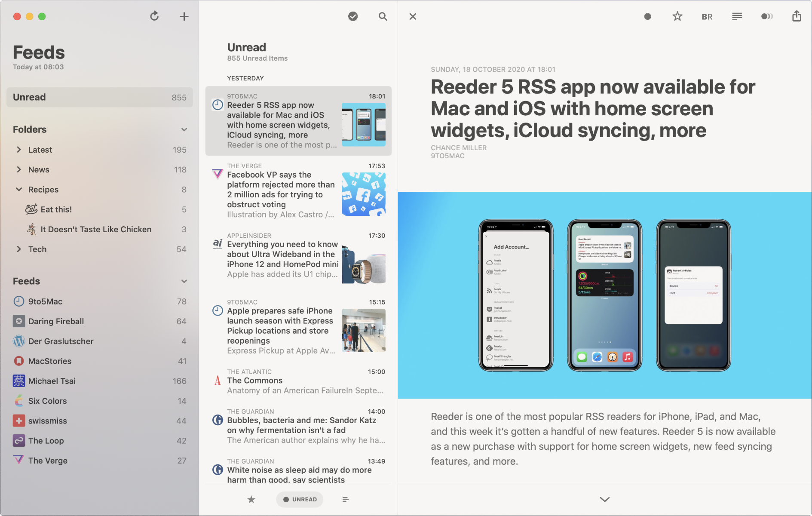

# RSS & Atom

If you listen to podcasts, you use RSS (Really Simple Syndication) one way or another. With RSS, you can "subscribe" to updates of news sites, blogs, and podcasts and read them all in one place.

An "RSS Feed" is an XML file containing articles on a site or podcast episodes.

https://validator.w3.org/feed/docs/rss2.html

The Atom standard (not to be confused with the [editor](https://github.com/atom/atom)) was developed as an alternative to RSS. Unfortunately for me, RSS has already gained critical mass and is unlikely ever to go away, but I favor Atom as the more thoughtful format in the RSS vs. Atom standoff.

https://validator.w3.org/feed/docs/atom.html

You can now read this blog in your favorite RSS reader app (most likely, it supports Atom as well). Feed link: https://chuhlomin.com/blog/feed.atom

I recommend the [Reeder app](https://reeder.app) with iCloud sync ($10 for macOS, 5 for iOS).

#blog #rfc #app
