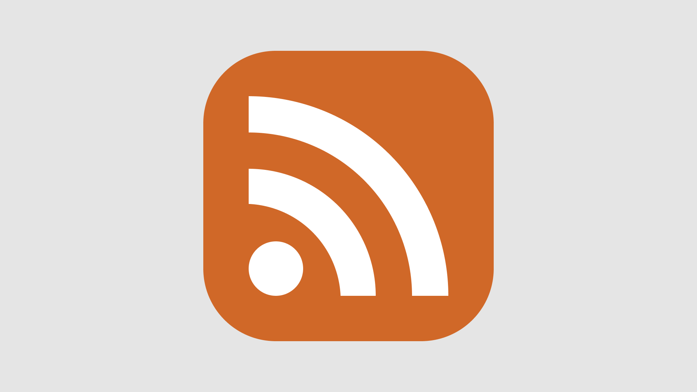

# RSS & Atom

Если вы слушаете подкасты, то так или иначе вы используете RSS (Really Simple Syndication).
С помощью RSS можно "подписаться" на обновления новостных сайтов, блогов, подкастов и читать их все одном месте.

"RSS-поток" представляет из себя XML файл, содержащий информацию о статьях на сайте или выпусках подкаста.

https://validator.w3.org/feed/docs/rss2.html

В качестве альтернативы RSS был разработан стандарт Atom (не путать с [редактором](https://github.com/atom/atom)).
К моему сожалению, RSS уже нарастил критическую массу и вряд ли когда-либо уйдёт в прошлое,
но в противостоянии RSS vs Atom я отдаю предпочтение Atom как более продуманному формату.

https://validator.w3.org/feed/docs/atom.html

Теперь этот блог можно читать в любимом приложении для чтения RSS (с большой вероятностью оно поддерживает и Atom). Ссылка на фид: https://chuhlomin.com/blog/feed.atom?lang=ru

Я рекомендую приложение [Reeder](https://reeder.app) с синхронизацией через iCloud ($10 для macOS, 5 для iOS).

#blog #rfc #app
