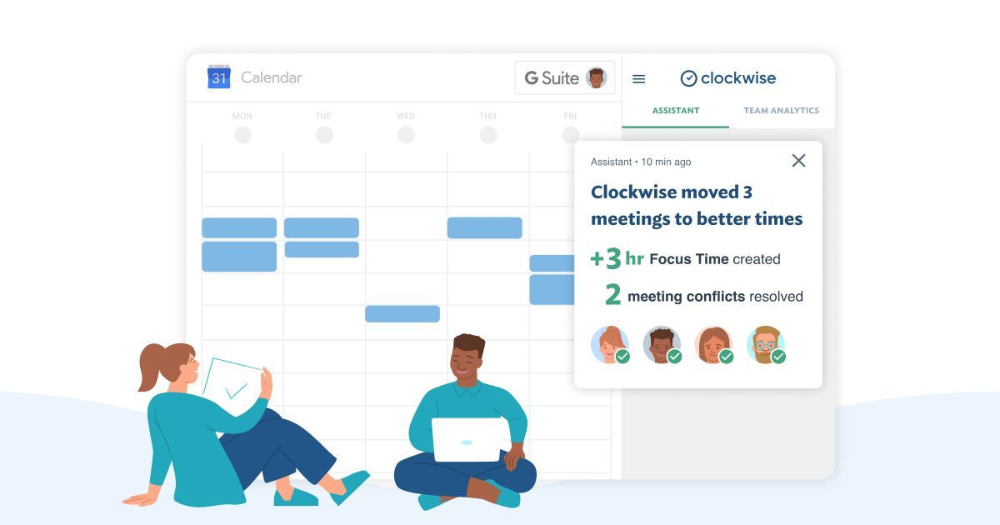

# Clockwise

Культура митингов (переговоров, встреч, совещаний) в большинстве компаний оставляет желать лучшего: день испещрённый митингами с перерывами по 15-30 минут — обычное дело. Даже если перерыв час или два, то этого едва хватает на то, чтобы сфокусироваться на задаче, не говоря уже о плодотворной работе.

Эту проблему старается решить Clockwise — сервис-дополнение к Google Calendar, который:

- подсказывает на какое время лучше поставить митинг, чтобы меньше всего навредить «времени фокусировки» участников
- сам переносит встречи, отданные под контроль «автопилота», на лучшее время, учитывая текущий календарь и предпочтения коллег (рабочие часы, время на обед)
https://www.getclockwise.com

К сожалению, работает только в Google Chrome (как расширение). Пока бесплатно.
https://chrome.google.com/webstore/detail/clockwise-time-management/hjcneejoopafkkibfbcaeoldpjjiamog

Ближайшие альтернативы: Plan, Planyway.

#service #calendar
