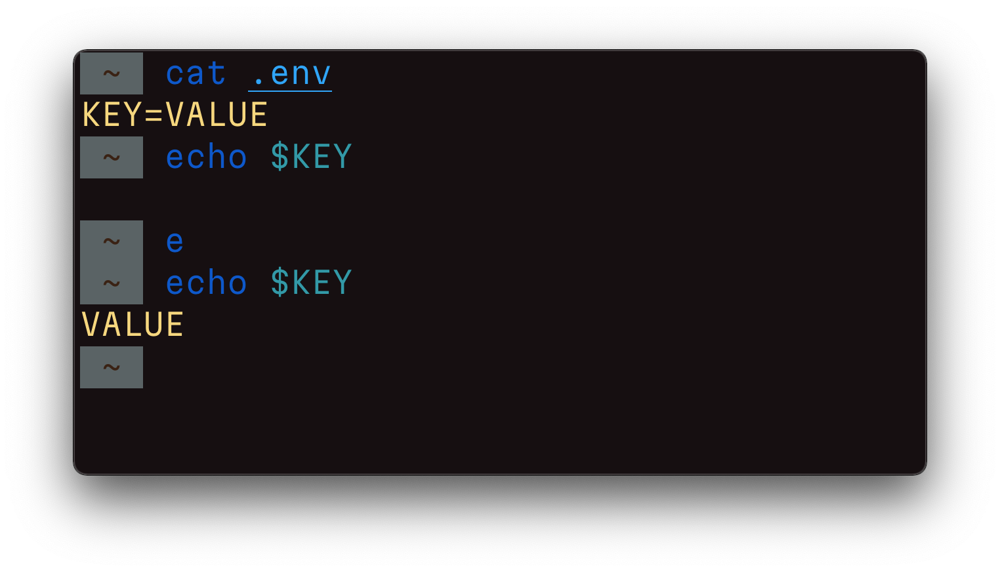

# Environment variables and alias `e`

Variables are "named memory areas." Like symbols in a mathematical formula, they can take on values and change them as the program runs.

Environment variables are those special variables that affect the operation of processes in the operating system.

The most common way to describe environment variables in the industry is a `.env` file, where each line has the format "KEY=VALUE".

Docker Compose knows how to work with such files by default:
https://docs.docker.com/compose/env-file/

There are two main console tools available to work with envs:

- `env` shows a list of current environment variables,
- `export` allows you to set a value of an environment variable.

However, I could not find an easy way to import values from an `.env` file. The art is clever: https://gist.github.com/mihow/9c7f559807069a03e302605691f85572

In bash you can do it this way: `. .env`. I made a small alias for fish:
https://github.com/chuhlomin/e

#cli #ops
