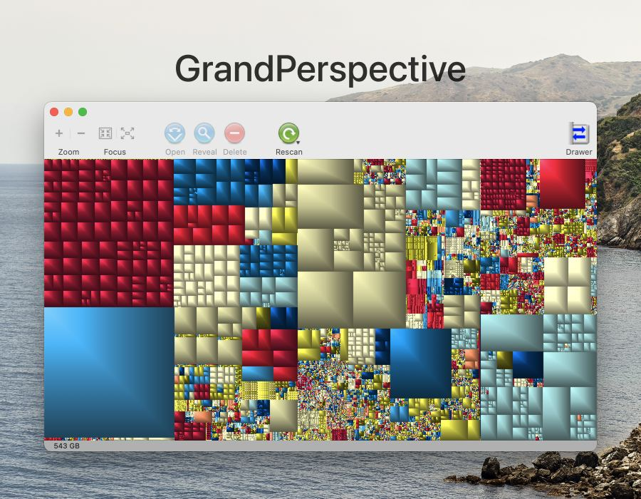

# GrandPerspective

GrandPerspective – это небольшое приложение от Erwin Bonsma для оценки занимаемого места на диске. Файловая система визуализирована в виде прямоугольника, внутри которого прямоугольники поменьше представляют файлы, размер которых пропорционален размеру файлов. Такое «полотно» позволяет быстро увидеть самы больше файлы, что бывает полезно с маленьким диском.

http://grandperspectiv.sourceforge.net

Код: https://sourceforge.net/projects/grandperspectiv/
App Store: https://itunes.apple.com/us/app/grandperspective/id1111570163

В качестве альтернативы, посмотрите на симпатичный DaisyDisk : https://daisydiskapp.com

#app #visualization #macos
