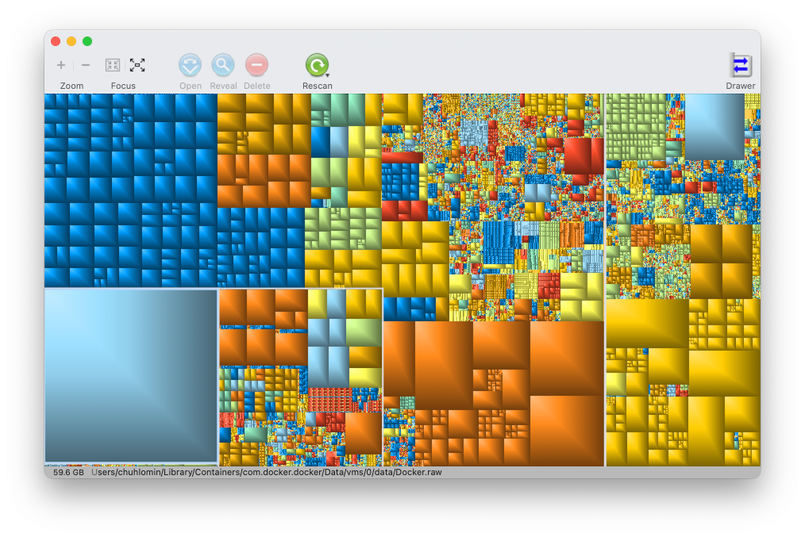

# GrandPerspective

GrandPerspective is a small application from Erwin Bonsma for analyzing disk space usage. The file system is visualized as a rectangle, inside which smaller rectangles represent files whose size is proportional to the size of the files. This "canvas" allows you to quickly see the largest files, which can come in handy with a small disk.

http://grandperspectiv.sourceforge.net

Source code: https://sourceforge.net/projects/grandperspectiv/  
App Store: https://itunes.apple.com/us/app/grandperspective/id1111570163

As an alternative, take a look at beautiful DaisyDisk: https://daisydiskapp.com

#app #visualization #macos
