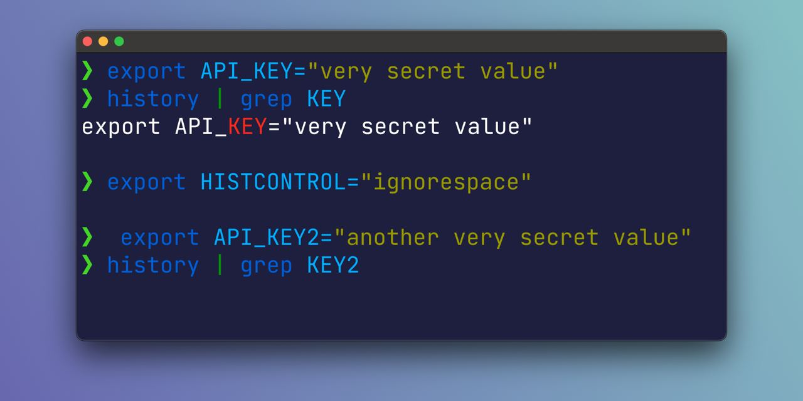

# Histcontrol

It's not a secret that commands executed in the terminal stay in the history (by default, the last 500).
Which is usually handy because you can "walk" through this history (up/down arrows), search (Control+R for reverse-i-search) or grep.  
https://ss64.com/bash/history.html

However, not everyone is careful with secrets (e.g. API keys) that are left in history. Of course, you can clean up secrets for yourself manually, but there is a better way – configure histcontrol:

```bash
HISTCONTROL=ignorespace
```

After that, all commands which start with a space will not go into the history.
https://www.gnu.org/software/bash/manual/bash.html#index-HISTCONTROL



#cli
