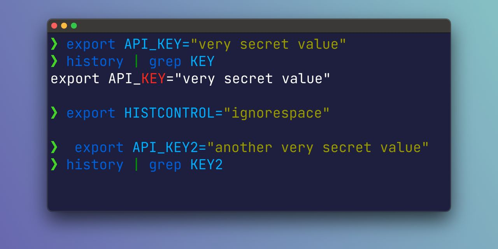

# Histcontrol

Не секрет, что выполненные в терминале команды остаются в истории (по умолчанию последние 500).
Что обычно удобно, потому что по этой истории можно «ходить» (стрелки вверх/вниз), искать (Control+R для reverse-i-search) или grep'ать.
https://ss64.com/bash/history.html

Однако, не все осторожно относятся к секретам (например, API ключам), которые остались в истории. Конечно, можно их вручную подчищать за собой, но есть способ получше – настроить histcontrol:

```bash
HISTCONTROL=ignorespace
```

После этого все команды, начинающиеся с пробела, не будут попадать в историю.
https://www.gnu.org/software/bash/manual/bash.html#index-HISTCONTROL



#cli
