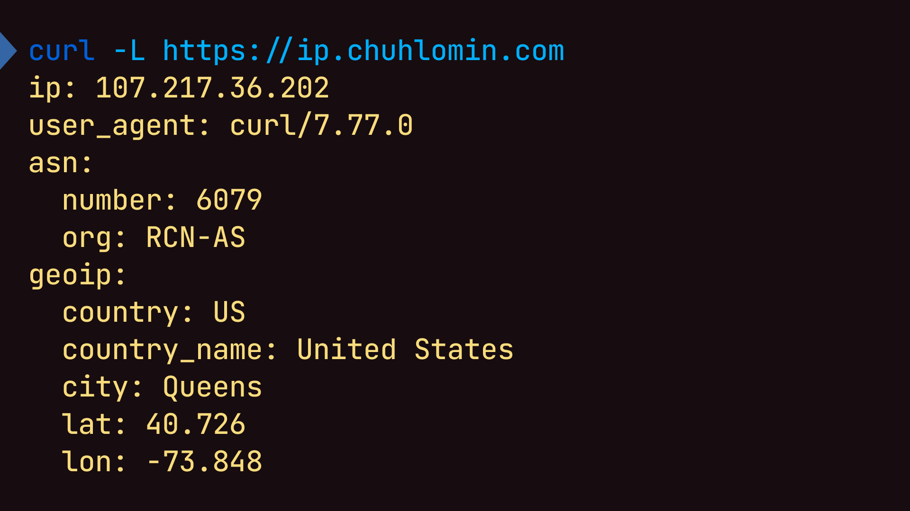

# IP



У каждого устройства в интернете есть свой IP-адрес.
Он может быть версии IPv4 (например 1.1.1.1) или IPv6 (например 2001:db8:0:1234:0:567:8:1).

Иногда бывает нужно узнать свой IP, или посмотреть информацию о другом IP.  
Для этих целей есть несколько сервисов:

* https://ip.me
* https://ifconfig.co
* https://httpbin.org/ip
* https://ipinfo.io
* https://whatismyipaddress.com

Мне же хотелось чего-то более минималистичного, без стилей, чтобы можно было
пользоваться и из консоли с `curl`.

Недолго думая, я написал небольшой сервис: https://ip.chuhlomin.com/

```bash
curl -L https://ip.chuhlomin.com
ip: 107.217.36.202
user_agent: curl/7.77.0
asn:
  number: 6079
  org: RCN-AS
geoip:
  country: US
  country_name: United States
  city: Queens
  lat: 40.726
  lon: -73.848
```

Используются:

* база от [GeoLite2](https://dev.maxmind.com/geoip/geolite2-free-geolocation-data) для определния города и провайдера (ASN).
* whois.iana.org для Whois запросов, например https://ip.chuhlomin.com/1.1.1.1/whois

Проверял только на IPv4, так что PR приветсвтуются: https://github.com/chuhlomin/ip

#project #ops #go
