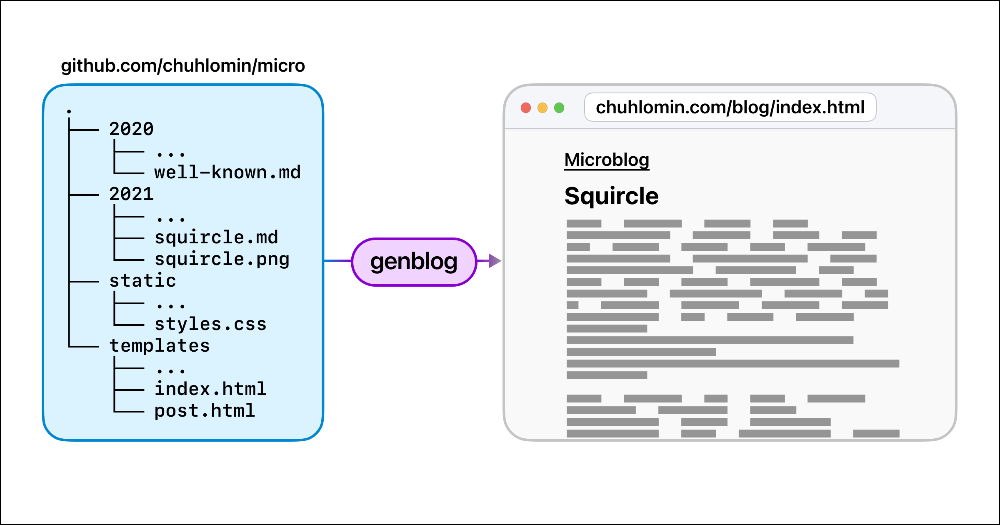

# Microblog

I've been writing to a [Telegram channel](https://t.me/chuhlomin_channel) for about a year and a half now.
All this time, I wanted to put all the posts on the web.

The basic requirements were the following:

* each post is a Markdown file in the Git-repository,
* when you push to the repository, some CI will generate a static site and deploy it,
* the resulting site should be "embeddable" in any other site,
* some internationalization support,
* comments.

There are many alternatives like [Hugo](https://gohugo.io),
[11ty](https://www.11ty.dev), [Ghost](http://ghost.org)
[buster](https://github.com/axitkhurana/buster).

But I wanted both “simple” and “smart”; for example,
the generator must understand that the file `bfg_ru.md` contains the post in Russian,
or that I could list the tags of posts at the end of the file and not describe them in some special format at the beginning of the file.
So, in short, I wrote a little [program in Go](https://github.com/chuhlomin/genblog) that takes the posts from the [repository](https://github.com/chuhlomin/micro) and builds a static HTML site in a second.

It's still pretty raw, but I'm already pretty happy with the result.

#blog #project #go
