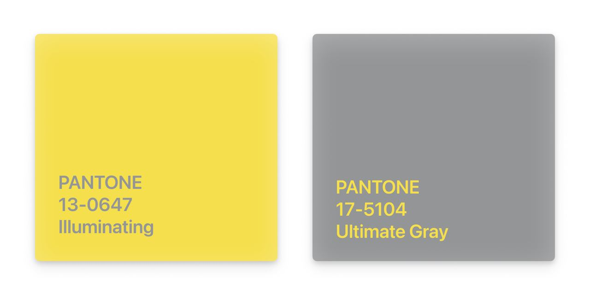

# Pantone Matching System (PMS)

Компания Pantone c штаб-квартирой в Нью-Джерси всемирно известна своей проприетарной системой цветов, которая используется повсеместно в графическом и продуктовом дизайне.  
https://www.pantone.com

Проще говоря, они дали номера и названия, пропорциям базовых цветовых пигментов. Например, цвет оранжевой ветки в Нью-Йорке закреплен за PMS 165 (маджента и желтый в соотношении 3/5).  
http://web.mta.info/developers/resources/line_colors.htm

Среди непрофессионалов эта компания получила известность тем, что c 2000 года выбирает цвет следующего года. Для 2021 их сразу два: PANTONE 17-5104 Ultimate Gray + PANTONE 13-0647 Illuminating

https://www.pantone.com/color-of-the-year-2021

#design
