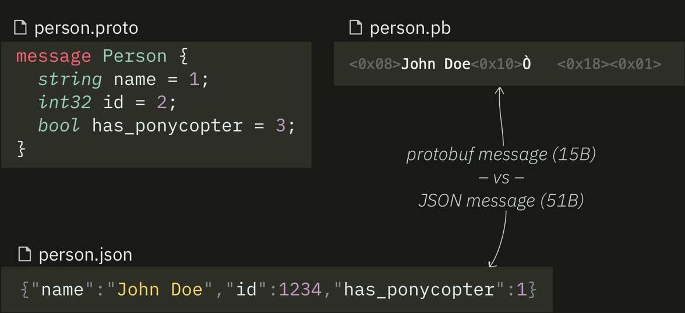

# Protobuf

Protocol Buffers is an open, extensible mechanism for serializing structured data developed at Google. Like JSON or XML, but binary, more compact. The "producer" and "consumer" of the message must agree on a "message schema" beforehand.

https://developers.google.com/protocol-buffers/

From Protobuf files you can generate code for different programming languages: Go, Java, Python, C++, C#, Ruby.

It is used by default in gRPC to describe service requests/responses.

In real life, Protobuf is used, for example, to send Apple News articles to your device and in a map application to get information about buses, streetcars, trains (GTFS Realtime).

Closest alternatives: Avro (commonly used with Kafka), Apache Thrift, Cap'n Proto.

Mini-demo repository: https://github.com/chuhlomin/protobuf-telegram-post

#proto #go
